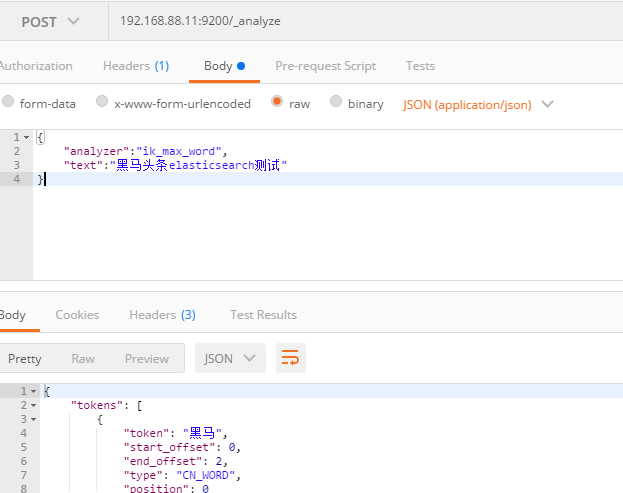

# 搭建ElasticSearch环境

## 1.拉取镜像

```shell
docker pull elasticsearch:7.4.0
```

## 2.创建容器

```shell
docker run -itd --name elasticsearch \
 --restart=always \
 -p 9200:9200 -p 9300:9300 \
 -v /docker/elasticsearch/plugins:/usr/share/elasticsearch/plugins \
 -e "discovery.type=single-node" elasticsearch:7.4.0
```

## 3.配置中文分词器 ik

因为在创建elasticsearch容器的时候，映射了目录，所以可以在宿主机上进行配置ik中文分词器

在去选择ik分词器的时候，需要与elasticsearch的版本好对应上

把资料中的`elasticsearch-analysis-ik-7.4.0.zip`上传到服务器上,放到对应目录（plugins）解压

```shell
#切换目录
cd /docker/elasticsearch/plugins
#新建目录
mkdir analysis-ik
cd analysis-ik
#上传 elasticsearch-analysis-ik-7.4.0.zip 到此目录
#然后解压
unzip elasticsearch-analysis-ik-7.4.0.zip
#解压完成后删除多余的zip文件
rm -rf elasticsearch-analysis-ik-7.4.0.zip
```

## 4.在postman测试一下


